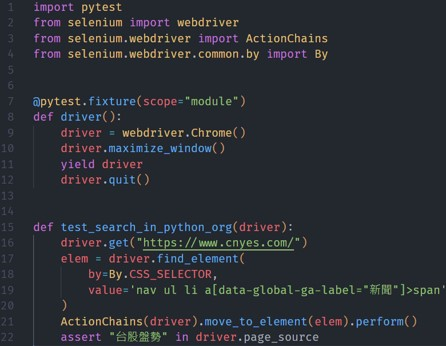
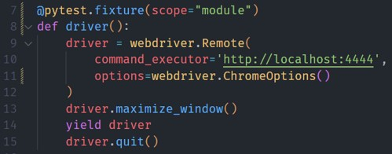

# 使用Docker啟動Selenium grid
使用Docker啟動[Selenium grid](https://www.selenium.dev/documentation/grid/)，並搭配簡單的瀏覽器測試

啟動環境

```
docker compose up –d
```
### 建立一個hub
mapping 4444port，到時候測試用4444port跟grid連接。

4442和4443port是給Event Bus使用，一個是發佈、一個是訂閱

### 多個Node
每個Node不同瀏覽器

如果需要監看瀏覽器操作流程，就要mapping port對應node 7900port。例如：
- chrome mapping 7900
- edge mapping 7901
- firefox mapping 7902

如果不需要監看就不開啟

### 檢查狀態
- http://localhost:4444/ui 檢查狀態
- http://localhost:{node的port} 監看瀏覽器操作

## 修改測試

### 修改前



用fixture建立一個chrome webdriver，打開鉅亨金融網首頁，然後將游標懸停在導航欄的新聞上，最後assert在頁面上看到「台股盤勢」四個字

### 修改後



改用Grid之後，將webdriver改為remote，連接剛才建立的hub，並且指定用chrome瀏覽器

然後打開http://localhost:{node的port} 監控chrome瀏覽器，預設的密碼是secret

回到command line，pytest執行測試，再回去瀏覽器，就能看到實際操作過程

## 不同瀏覽器測試

要在不同瀏覽器執行同一個測試，可以使用pytest parametrizing fixtures

在fixture加上params參數，這邊加上要測試的瀏覽器list。當執行driver這個function時，request.param會按照順序取得chrome, edge, firefox。又新增了create_options function，依照傳入的瀏覽器名稱回傳options

這樣就可以讓一個測試用三種瀏覽器測試

為了並行測試，安裝pytest-xdist，讓它用多個CPU加速處理多個測試

最後回到cmd，pytest –n 3執行測試